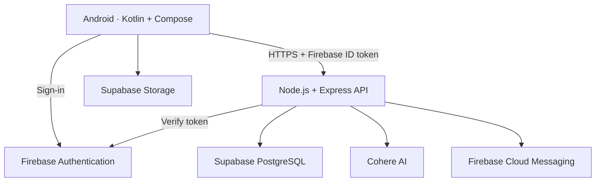

<a id="top"></a>

<p align="center">
  
</p>

# 🍃 Elachi - Your Digital Kitchen Companion

> 🌿 *“Mouth Full Of Flavour.”*

**📖 Collect recipes · 🥬 Prepare your pantry · 🍳 Cook with confidence**

<p align="left">
  
  
  
  
</p>

<p align="left">
  <a href="https://youtu.be/_9Ekp7AXjG8"></a>
  <a href="https://github.com/EMKNDN/emkndn-prog7314-2026-prog7314-poe-st10439057"></a>
</p>

<p align="left">
  <a href="#my-contribution">My Contribution</a> ·
  <a href="#custom-features">Feature Highlights</a> ·
  <a href="#design-system">Design System</a> ·
  <a href="#getting-started">Run the App</a>
</p>

---

**Elachi** is an Android recipe management application developed by a **four-person team** for our **PROG7314 academic project (2026)**. It brings recipes, cookbooks, pantry ingredients and cooking tools into one place, with Firebase Authentication, a custom Express API and Supabase cloud services.

> 🍃 **About this repository:** This is my personal portfolio copy of our team project. I am **Lavanya Pillay** ([Lavanyax24](https://github.com/Lavanyax24)), and this repository showcases my contribution within the complete application. Credit for the full project belongs to the team below.

## 🧭 Table of Contents

| 🍃 Start Here | 🍳 Explore the App | 🛠️ Behind the Scenes |
| :--- | :--- | :--- |
| [🙋 My Contribution](#my-contribution) | [✨ Custom Features](#custom-features) | [🧰 Tech Stack](#tech-stack) |
| [🍲 Project Overview](#project-overview) | [🌿 All Features](#all-features) | [🗂️ Project Structure](#project-structure) |
| [🎬 Watch the Demo](#demonstration) | [📖 Recipes & Cook Mode](#recipes-and-cook-mode) | [🎨 Design System](#design-system) |
| [🚀 Setup & Testing](#getting-started) | [🥬 Pantry & Kitchen Tools](#pantry-and-tools) | [🏗️ System Architecture](#architecture) |
| [🌱 Future Enhancements](#future-enhancements) | [👩‍🍳 AI Chef & Progress](#ai-and-progress) | [🤝 Team & Attribution](#team-attribution) |
| [📚 References](#references) | [⬆️ Back to Top](#top) | [📄 Project Rights](#project-rights) |

---

<a id="team-attribution"></a>

## 🤝 Meet the Team

| Team member | Student number | Allocated workstream |
| --- | --- | --- |
| **Lavanya Pillay** | **ST10438009** | **Recipes, pantry, discovery, timer, Android AI Chef, achievements and streaks** |
| Jarrud Frederick Cochrane | ST10266083 | Data layer, authentication, home/profile/notifications, Android tests and CI |
| Saa'diyah Mansoor | ST10439057 | Setup, onboarding, calculator/converter, settings/legal/help, shared docs/video |
| Diya Lakha | ST10439176 | Backend API, backend tests, deployment verification, shared docs/video |

---

<a id="my-contribution"></a>

## 🙋 My Contribution

My assigned areas covered much of the day-to-day cooking experience:

- **📖 Cookbooks & Recipes** - cookbook screens and ViewModels; recipe entry and detail screens; recipe navigation, serving controls and PDF export.
- **📷 Recipe Scanning & Cook Mode** - CameraX/ML Kit capture screens and ViewModel, plus guided cooking with timers and spoken instructions.
- **🥬 Pantry & Shopping List** - pantry screens and ViewModel, ingredient quantity/unit entry and the shopping-list interface.
- **⏱️ Kitchen Timer** - custom duration inputs, start/pause/reset controls and a completion sound.
- **🔎 Discover Recipes** - the public recipe discovery interface, search and filtering.
- **👩‍🍳 AI Chef Interface** - the Android chat screen and ViewModel connected to the team's backend AI service.
- **🏅 Achievements & Streaks** - achievement progress cards and the cooking streak calendar.

These responsibilities follow **Phases 4, 5a and 6b** of the team allocation. The original Git history records individual commits and shared integration changes. Authentication, shared data repositories, the backend API, cloud integration, backend AI calls and server-side achievement logic were part of my teammates' workstreams.

<details>
<summary><strong>🌿 Explore my assigned feature areas</strong></summary>

| Area | Source | Assigned branch |
| --- | --- | --- |
| Recipes and cookbooks | [Cookbook screens](andriod/app/src/main/java/com/elachi/app/ui/cookbook/) · [Recipe screens](andriod/app/src/main/java/com/elachi/app/ui/recipe/) | `feature/lavanya-recipes` |
| Pantry and timer | [Pantry screens](andriod/app/src/main/java/com/elachi/app/ui/pantry/) | `feature/lavanya-pantry` |
| Recipe discovery | [Discover screen](andriod/app/src/main/java/com/elachi/app/ui/discover/) | `feature/lavanya-pantry` |
| AI Chef | [Chat interface and ViewModel](andriod/app/src/main/java/com/elachi/app/ui/aichef/) | `feature/lavanya-aichef-achievements` |
| Achievements and streaks | [Achievements](andriod/app/src/main/java/com/elachi/app/ui/achievements/) · [Streak calendar](andriod/app/src/main/java/com/elachi/app/ui/streak/) | `feature/lavanya-aichef-achievements` |

</details>

---


<a id="project-overview"></a>

## 🍲 Project Overview

Elachi is designed to make a recipe collection useful in the kitchen. Users can organise favourite meals into cookbooks, keep track of ingredients and follow cooking steps without constantly switching between tools.

| 📖 Collect | 🥬 Prepare | 🍳 Cook |
| :--- | :--- | :--- |
| Create recipe books, save favourites and capture recipe text. | Track pantry ingredients, build shopping lists and discover meal ideas. | Adjust servings, follow spoken steps, use timers and export recipe PDFs. |

The app combines **Jetpack Compose screens**, **ViewModels and repositories**, **Room/DataStore persistence**, and a **Firebase-authenticated REST API**. Supabase provides PostgreSQL data storage and image storage; Cohere powers the backend AI service.

---

<a id="custom-features"></a>

## ✨ Custom Features

### 📷 From Recipe Text to Your Cookbook

CameraX and Google ML Kit support recipe text capture. The recipe workflow helps users bring recipe information into the app instead of entering everything manually.

### 👩‍🍳 An AI Chef in Your Pocket

The chat interface connects to the backend's Cohere integration for cooking questions and ingredient ideas. The backend can include pantry ingredients as context, while keeping the AI credential on the server.

### 🏅 Progress Beyond the Recipe

Achievement cards and a cooking streak calendar give users a visual record of their cooking activity. The Android interfaces connect with the team's shared data and backend progression logic.

---

<a id="all-features"></a>

## 🌿 All Features

| Feature | What it offers |
| --- | --- |
| 🔐 Authentication | Firebase email/password authentication and Google sign-in integration |
| 🏠 Home & Profile | Dashboard, user profile and cooking preferences |
| 📚 Recipe Books | Customised books for organising recipe collections |
| 📝 Recipe Management | Create, view, edit and delete recipes with ingredients, units and ordered steps |
| ❤️ Favourites | Mark favourite recipes in your collection |
| 📷 Recipe Capture | Camera capture and ML Kit text recognition |
| 🍳 Cook Mode | Step-by-step instructions, timers and text-to-speech |
| 📄 PDF Export | Export a recipe for sharing or keeping outside the app |
| 🥬 Pantry | Ingredient tracking with quantities and units |
| 🛒 Shopping List | Maintain a list and generate missing ingredients from a recipe |
| 🔎 Discovery | Browse, search and filter public recipes |
| 💡 Pantry Suggestions | Request recipe matches based on available ingredients |
| 🧮 Kitchen Tools | Timer, unit converter and calculator |
| 👩‍🍳 AI Chef | Cooking chat through the backend AI service |
| 🏅 Achievements & Streaks | Cooking milestones, progress and activity calendar |
| 🌙 Settings & Notifications | Light/dark appearance, account settings and Firebase messaging integration |
| 💾 Local Persistence | Room and DataStore support for local data and preferences |

**Snapshot status:** This is the academic source snapshot. Some controls, including recipe forking, remain placeholders; cloud-dependent features need configured services.

---

<a id="recipes-and-cook-mode"></a>

## 📖 Recipes & Cook Mode

A recipe carries more than a title and a list of ingredients. Elachi supports quantities and units, servings, categories, cooking details, allergens, images and ordered instructions.

- **Organise:** group recipes into personalised books with icon and colour choices.
- **Capture:** enter recipes manually or use the camera/text-recognition workflow.
- **Adapt:** adjust servings to scale ingredient quantities.
- **Cook:** move through ordered steps with spoken instructions and timers.
- **Keep:** mark favourites and export a recipe as a PDF.

**Assigned contribution area:** recipe and cookbook interfaces, ViewModels, capture screens and cooking navigation. These use the team's shared repositories and API.

---

<a id="pantry-and-tools"></a>

## 🥬 Pantry & Kitchen Tools

The pantry records ingredients with quantities and units. Shopping lists help users prepare for a recipe, while backend recipe matching supplies suggestions based on ingredients already available.

| Tool | Cooking use |
| --- | --- |
| 🥬 Digital Pantry | See which ingredients are on hand |
| 🛒 Shopping List | Track what still needs to be purchased |
| ⏱️ Kitchen Timer | Set a duration, pause/reset it and hear a completion sound |
| ⚖️ Unit Converter | Convert supported measurement units |
| 🧮 Calculator | Perform everyday kitchen calculations |

**Assigned contribution area:** pantry/shopping interfaces and kitchen timer. The standalone converter and calculator were allocated to Saa'diyah; ingredient matching belongs to the backend workstream.

---

<a id="ai-and-progress"></a>

## 👩‍🍳 AI Chef & Cooking Progress

**AI Chef** provides a chat interface for cooking guidance and meal ideas. Users can ask questions such as *“What can I make with rice and eggs?”* The request passes through the backend, which supplies relevant pantry context to Cohere.

**Achievements** display cooking milestones and progress. The **streak calendar** makes recorded cooking activity visible over time.

**Assigned contribution area:** Android chat screen/ViewModel, achievement interface and streak calendar. Cohere integration and server-side calculations were allocated to the backend workstream.

---

<a id="demonstration"></a>

## 🎬 Project Demonstration

<p align="left">
  <a href="https://youtu.be/_9Ekp7AXjG8"></a>
</p>

The team demonstration covers the Android application and its Render, Firebase and Supabase integrations.

The header uses the **original Elachi logo** included in the app. Application screenshots are not bundled in this source snapshot; the demo provides the app walkthrough.

---

<a id="tech-stack"></a>

## 🧰 Tech Stack

| Layer | Technology |
| --- | --- |
| Language | Kotlin |
| Android UI | Jetpack Compose, Material 3 |
| Navigation & State | Navigation Compose, ViewModels, Kotlin coroutines |
| Local Data | Room, DataStore |
| Networking | Retrofit, OkHttp |
| Image Loading | Coil |
| Camera & OCR | CameraX, Google ML Kit |
| Authentication | Firebase Authentication, Google sign-in |
| Notifications | Firebase Cloud Messaging |
| Backend | Node.js, Express, Firebase Admin SDK |
| Database & Storage | Supabase PostgreSQL, Supabase Storage |
| AI | Cohere through the backend |
| Backend Hosting | Render |
| Testing | JUnit, Jest, Supertest |
| Build & Automation | Gradle Kotlin DSL, GitHub Actions |
| Minimum Android Version | API 24 - Android 7.0 |
| Compile / Target SDK | API 35 |
| Java Toolchain | JDK 17 |

---

<a id="project-structure"></a>

## 🗂️ Project Structure

**⭐ marks my assigned feature areas.** Shared source files may include contributions from multiple team members.

| Path | Purpose |
| --- | --- |
| [`andriod/`](andriod/) | Native Android application - folder spelling retained from the team repository |
| [`…/ui/cookbook/`](andriod/app/src/main/java/com/elachi/app/ui/cookbook/) ⭐ | Cookbook screens and ViewModels |
| [`…/ui/recipe/`](andriod/app/src/main/java/com/elachi/app/ui/recipe/) ⭐ | Recipe entry/detail, camera capture and cook mode |
| [`…/ui/pantry/`](andriod/app/src/main/java/com/elachi/app/ui/pantry/) ⭐ | Pantry, shopping-list interface and timer |
| [`…/ui/discover/`](andriod/app/src/main/java/com/elachi/app/ui/discover/) ⭐ | Public recipe discovery |
| [`…/ui/aichef/`](andriod/app/src/main/java/com/elachi/app/ui/aichef/) ⭐ | AI Chef interface and ViewModel |
| [`…/ui/achievements/`](andriod/app/src/main/java/com/elachi/app/ui/achievements/) ⭐ | Achievement progress interface |
| [`…/ui/streak/`](andriod/app/src/main/java/com/elachi/app/ui/streak/) ⭐ | Cooking streak calendar |
| [`…/data/`](andriod/app/src/main/java/com/elachi/app/data/) | Shared Room entities/DAOs, API client and repositories |
| [`…/navigation/`](andriod/app/src/main/java/com/elachi/app/navigation/) | Shared routes and navigation integration |
| [`…/ui/theme/`](andriod/app/src/main/java/com/elachi/app/ui/theme/) | Elachi colours, typography and Material theme |
| [`backend/`](backend/) | Express API and backend services |
| [`backend/src/db/schema.sql`](backend/src/db/schema.sql) | PostgreSQL schema |
| [`.github/workflows/`](.github/workflows/) | Android and backend workflows |
| [`docs/TEAM_README.md`](docs/TEAM_README.md) | Preserved team documentation and acknowledgements |

---

<a id="design-system"></a>

## 🎨 Design System

Elachi's palette draws on **olive greens, warm earth tones and cream surfaces**, with orange highlights. The colours below come directly from the application's [Color.kt](andriod/app/src/main/java/com/elachi/app/ui/theme/Color.kt) and [Theme.kt](andriod/app/src/main/java/com/elachi/app/ui/theme/Theme.kt).

| Colour | Token | Hex | Use in the app |
| --- | --- | --- | --- |
|  | `ElachiGreen` | `#425529` | Primary controls and brand accents |
|  | `ElachiGreenLight` | `#5A6E3F` | Primary colour in dark mode |
|  | `ElachiBrown` | `#3D2E13` | Secondary colour in light mode |
|  | `ElachiCream` | `#FCF9F4` | Light-mode background |
|  | `ElachiAccent` | `#D97706` | Accent and dark-mode secondary colour |
|  | `DarkBackground` | `#12140E` | Dark-mode background |

The app supports **light and dark themes** through its Material 3 colour schemes. This README echoes the app's palette in its badges while keeping GitHub's native page background.

---

<a id="architecture"></a>

## 🏗️ System Architecture

Firebase handles sign-in; the Android app attaches the user's ID token to API calls. Express verifies the token and accesses the database or supporting services. Image uploads use Supabase Storage, while Room and DataStore provide local persistence.



---

<a id="getting-started"></a>

## 🚀 Getting Started & Testing

<details>
<summary><strong>📦 Requirements, backend configuration and Android setup</strong></summary>


### ✅ What You’ll Need

- Android Studio with Android SDK 35 and JDK 17.
- Android device/emulator running Android 7.0 (API 24) or later.
- Node.js 20 or newer and npm.
- Your own Firebase and Supabase projects; a Cohere key for AI features.

### 📥 Clone the Project

```bash
git clone https://github.com/Lavanyax24/Elachi.git
cd Elachi
```

The Android folder is named **`andriod/`** in this repository. Use that exact spelling in paths.

### 🌐 Set Up the Backend

From `backend/`, install dependencies and copy the configuration template:

```powershell
npm ci
Copy-Item .env.example .env
```

On macOS/Linux, use `cp .env.example .env` instead. Set these values in the local `.env`:

| Variable | Purpose |
| --- | --- |
| `DATABASE_URL` | PostgreSQL connection string for your database |
| `FIREBASE_SERVICE_ACCOUNT_JSON` | Firebase Admin service-account JSON for your project |
| `COHERE_API_KEY` | Cohere credential for AI endpoints |
| `PORT` | Local API port; template uses `3000` |

Apply the schema to your own database, then start the server:

```bash
npm run db:init
npm run dev
```

The local health endpoint is `http://localhost:3000/health` when using port 3000. See [backend documentation](backend/README.md) and the [database schema](backend/src/db/schema.sql) for more detail.

### 📱 Run the Android App

1. Open `andriod/` in Android Studio and install the required SDK packages.
2. Register application ID `com.elachi.app.new` in your Firebase project. Enable the authentication providers you intend to use and place your Android configuration in `andriod/app/google-services.json`.
3. Register the appropriate signing fingerprints for Google sign-in.
4. Configure `API_BASE_URL`, `SUPABASE_URL`, `SUPABASE_ANON_KEY` and `SUPABASE_BUCKET` in [app/build.gradle.kts](andriod/app/build.gradle.kts) for your services. Keep the API URL's trailing slash. The source snapshot points at the team's hosted backend by default.
5. Create/configure the image storage bucket and access policies. Never place a Supabase service-role key or backend service-account private key in the Android app.
6. Sync Gradle and run the app on your device or emulator.

For a local backend, use a device-reachable URL. Android emulators typically reach the host at `10.0.2.2`; physical devices need the host's LAN address. Local HTTP may require a development-only Android network configuration.

### 🧪 Build & Test

Backend, from `backend/`:

```bash
npm ci
npm test
```

Android, from `andriod/` on Windows:

```powershell
.\gradlew.bat :app:testDebugUnitTest
.\gradlew.bat :app:assembleDebug
```

On macOS/Linux, use `./gradlew` instead. Android utility tests cover serving scaling and recipe-text parsing. Backend tests use Jest and Supertest. The included [Android workflow](.github/workflows/android-ci.yml) and [backend workflow](.github/workflows/backend-ci.yml) currently run manually through `workflow_dispatch`.


</details>

---

<a id="future-enhancements"></a>

## 🌱 Future Enhancements

Possible next steps for the project include:

- **Recipe forking** - turn the current placeholder into a working recipe-copy workflow.
- **More robust recipe capture** - improve handling of varied layouts and OCR results.
- **Deeper cooking insights** - build on existing streak and achievement information.
- **Broader verification** - expand device testing and coverage of cloud-dependent workflows.

These are improvement ideas, rather than features claimed for the current snapshot.

---

<a id="references"></a>

## 📚 References & Attribution

- **[Original team repository](https://github.com/EMKNDN/emkndn-prog7314-2026-prog7314-poe-st10439057)** - shared project source and development history.
- **[Team documentation](docs/TEAM_README.md)** - preserved project documentation, source acknowledgements and references.
- **[Backend README](backend/README.md)** - API, database and deployment documentation.
- **[API testing notes](backend/tests/endpoints.md)** - endpoint testing documentation.
- **[Project demonstration](https://youtu.be/_9Ekp7AXjG8)** - team application walkthrough.

The team's build plan describes adapting an AI-assisted starting version. Existing source comments, references and any AI usage documentation remain part of the project attribution.

<a id="project-rights"></a>

## 📄 Project Rights

Elachi is an academic team project. This personal copy introduces no new software licence. Original materials remain subject to the team's and applicable institution's rights; third-party dependencies retain their own licences.

---

### 🍃 Elachi · Mouth Full Of Flavour
*🤝 Developed collaboratively by Lavanya Pillay, Jarrud Frederick Cochrane, Saa'diyah Mansoor and Diya Lakha.*
🙋 Shared by **[Lavanya Pillay](https://github.com/Lavanyax24)** to showcase my contribution.
[⬆️ Back to top](#top)
