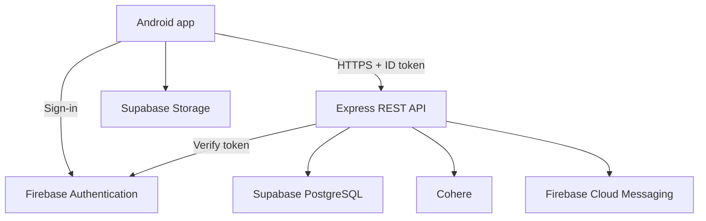

<p align="center">
  
</p>

<h1 align="center">Elachi</h1>
<p align="center"><strong>Mouth Full Of Flavour</strong></p>
<p align="center">An Android recipe management application with pantry tools, recipe scanning and an AI cooking assistant.</p>
<p align="center">
  <a href="https://youtu.be/_9Ekp7AXjG8">Watch the project demonstration</a> ·
  <a href="#my-contribution">My contribution</a> ·
  <a href="#getting-started">Run the project</a>
</p>

## About the project

Elachi helps users organise recipes, plan meals using pantry ingredients and follow recipes while cooking. It combines a native Kotlin and Jetpack Compose Android application with an Express REST API, Supabase PostgreSQL and Firebase Authentication.

This repository is my personal portfolio copy of a **four-person academic team project developed in 2026**. I am **Lavanya Pillay** ([Lavanyax24](https://github.com/Lavanyax24)). The complete application is included to demonstrate how my work fits into the shared system; the project was developed collaboratively.

## My contribution

My assigned development areas were **Phase 4 — Recipes**, **Phase 5a — Pantry, Timer and Discover**, and **Phase 6b — AI Chef, Achievements and Streaks**, as recorded in the team's build plan. The table below describes those areas and links to their implementation in this source snapshot. The allocation records responsibility; the original Git history provides the record of individual commits and later shared changes.

| Area | My assigned work | Source |
| --- | --- | --- |
| Cookbooks and recipes | Cookbook screens and ViewModel; recipe entry, detail screens and ViewModels; recipe navigation | [Cookbooks](andriod/app/src/main/java/com/elachi/app/ui/cookbook/) · [Recipes](andriod/app/src/main/java/com/elachi/app/ui/recipe/) |
| Recipe capture and cooking | Camera/OCR screens and ViewModel; guided cook mode with timers and text-to-speech; serving controls and PDF export in recipe detail | [Recipe screens](andriod/app/src/main/java/com/elachi/app/ui/recipe/) |
| Pantry and shopping list | Pantry ViewModel and screens, ingredient quantity/unit entry and shopping-list interface | [Pantry](andriod/app/src/main/java/com/elachi/app/ui/pantry/) |
| Kitchen timer | Custom duration controls, start/pause/reset behaviour and completion sound | [PantryScreen.kt](andriod/app/src/main/java/com/elachi/app/ui/pantry/PantryScreen.kt) |
| Recipe discovery | Public recipe discovery interface with search and filtering | [DiscoverScreen.kt](andriod/app/src/main/java/com/elachi/app/ui/discover/DiscoverScreen.kt) |
| AI Chef | Android chat interface and ViewModel connected to the team's backend AI service | [AI Chef](andriod/app/src/main/java/com/elachi/app/ui/aichef/) |
| Achievements and streaks | Achievement progress interface and cooking streak calendar | [Achievements](andriod/app/src/main/java/com/elachi/app/ui/achievements/) · [Streaks](andriod/app/src/main/java/com/elachi/app/ui/streak/) |

Assigned branches: `feature/lavanya-recipes`, `feature/lavanya-pantry` and `feature/lavanya-aichef-achievements`.

These features integrate with the shared repositories, authentication, API and database developed by the team. Backend AI integration and server-side achievement/streak logic belong to the backend workstream.

## Features

- **Recipe collection:** create, edit and delete recipes; organise them into customised recipe books and mark favourites.
- **Recipe capture:** use CameraX and ML Kit to capture and recognise recipe text.
- **Cooking support:** adjust servings, follow step-by-step cook mode with spoken instructions and timers, and export recipes as PDFs.
- **Pantry and shopping:** track ingredients, maintain shopping lists and request pantry-based recipe suggestions.
- **Discovery:** browse and search public recipes.
- **AI Chef:** ask cooking questions through a backend service that supplies pantry context to Cohere.
- **Progress:** view achievements and cooking streaks.
- **Shared platform:** Firebase sign-in, user profiles, settings, notifications and local persistence.

Some controls in this academic snapshot remain placeholders, including recipe forking. Cloud-dependent features require configured services.

## Demonstration and visuals

[**Watch the Elachi demonstration on YouTube**](https://youtu.be/_9Ekp7AXjG8)

The demonstration covers the Android application and its backend/cloud integrations. The header uses the existing Elachi logo from the application resources. This source snapshot includes branding assets rather than a gallery of application screenshots.

## Technology stack

| Layer | Technologies |
| --- | --- |
| Android interface | Kotlin, Jetpack Compose, Material 3, Navigation Compose |
| App state and data | ViewModels, repositories, coroutines, Room, DataStore |
| Networking and images | Retrofit, OkHttp, Coil |
| Camera and text recognition | CameraX, Google ML Kit |
| Authentication and notifications | Firebase Authentication, Google sign-in, Firebase Cloud Messaging |
| Backend | Node.js, Express, Firebase Admin SDK |
| Database and image storage | Supabase PostgreSQL, Supabase Storage |
| AI service | Cohere, accessed through the backend |
| Hosting | Render for the team's backend deployment |
| Testing and automation | JUnit, Jest, Supertest, GitHub Actions |

## Architecture

The Android app signs users in through Firebase and attaches their Firebase ID token to API requests. The Express backend verifies the token, performs database operations and calls supporting services. The app also uses Supabase Storage for image uploads and Room/DataStore for local data.



## Getting started

### Requirements

- Android Studio with Android SDK 35 and JDK 17.
- Android device/emulator running Android 7.0 (API 24) or later.
- Node.js 20 or newer and npm.
- Your own Firebase and Supabase projects; a Cohere key for AI features.

### Clone

```bash
git clone https://github.com/Lavanyax24/Elachi.git
cd Elachi
```

The Android folder is named **`andriod/`** in this repository. Use that exact spelling in paths.

### Backend

From `backend/`, install dependencies and copy the configuration template:

```powershell
npm ci
Copy-Item .env.example .env
```

On macOS/Linux, use `cp .env.example .env` instead. Set these values in the local `.env`:

| Variable | Purpose |
| --- | --- |
| `DATABASE_URL` | PostgreSQL connection string for your database |
| `FIREBASE_SERVICE_ACCOUNT_JSON` | Firebase Admin service-account JSON for your project |
| `COHERE_API_KEY` | Cohere credential for AI endpoints |
| `PORT` | Local API port; template uses `3000` |

Apply the schema to your own database, then start the server:

```bash
npm run db:init
npm run dev
```

The local health endpoint is `http://localhost:3000/health` when using port 3000. See [backend documentation](backend/README.md) and the [database schema](backend/src/db/schema.sql) for more detail.

### Android

1. Open `andriod/` in Android Studio and install the required SDK packages.
2. Register application ID `com.elachi.app.new` in your Firebase project. Enable the authentication providers you intend to use and place your Android configuration in `andriod/app/google-services.json`.
3. Register the appropriate signing fingerprints for Google sign-in.
4. Configure `API_BASE_URL`, `SUPABASE_URL`, `SUPABASE_ANON_KEY` and `SUPABASE_BUCKET` in [app/build.gradle.kts](andriod/app/build.gradle.kts) for your services. Keep the API URL's trailing slash. The source snapshot points at the team's hosted backend by default.
5. Create/configure the image storage bucket and access policies. Never place a Supabase service-role key or backend service-account private key in the Android app.
6. Sync Gradle and run the app on your device or emulator.

For a local backend, use a device-reachable URL. Android emulators typically reach the host at `10.0.2.2`; physical devices need the host's LAN address. Local HTTP may require a development-only Android network configuration.

## Testing

Backend, from `backend/`:

```bash
npm ci
npm test
```

Android, from `andriod/` on Windows:

```powershell
.\gradlew.bat :app:testDebugUnitTest
.\gradlew.bat :app:assembleDebug
```

On macOS/Linux, use `./gradlew` instead. Android utility tests cover serving scaling and recipe-text parsing. Backend tests use Jest and Supertest. The included [Android workflow](.github/workflows/android-ci.yml) and [backend workflow](.github/workflows/backend-ci.yml) currently run manually through `workflow_dispatch`.

## Team and attribution

Responsibilities below follow the supplied team allocation. Shared integration and later fixes may span these areas.

| Team member | Allocated responsibilities |
| --- | --- |
| **Lavanya Pillay** | Recipes and cookbooks; pantry, timer and discovery; Android AI Chef, achievements and streak screens |
| **Jarrud Frederick Cochrane** | Data layer, authentication screens, home/profile/notifications, Android tests and CI |
| **Saa'diyah Mansoor** | Project setup, onboarding, calculator/converter, settings/legal/help, shared documentation and video |
| **Diya Lakha** | Backend API, backend tests, deployment verification, shared documentation and video |

This portfolio copy retains the team's authorship and existing source acknowledgements. The original team documentation and references are preserved in [TEAM_README.md](docs/TEAM_README.md).

The build plan describes starting from an AI-assisted version and adapting it during development. This portfolio presentation does not claim that every line was written from scratch. Existing code comments, references and any AI usage documentation should remain with the source.

Original team repository: [Elachi team repository](https://github.com/EMKNDN/emkndn-prog7314-2026-prog7314-poe-st10439057).

## Project rights

Elachi was developed as an academic team project. This portfolio copy does not introduce a new software licence. Source code and original materials remain subject to the team's and applicable institution's rights and requirements; third-party dependencies retain their own licences.
